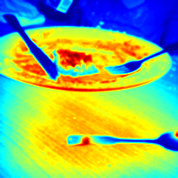
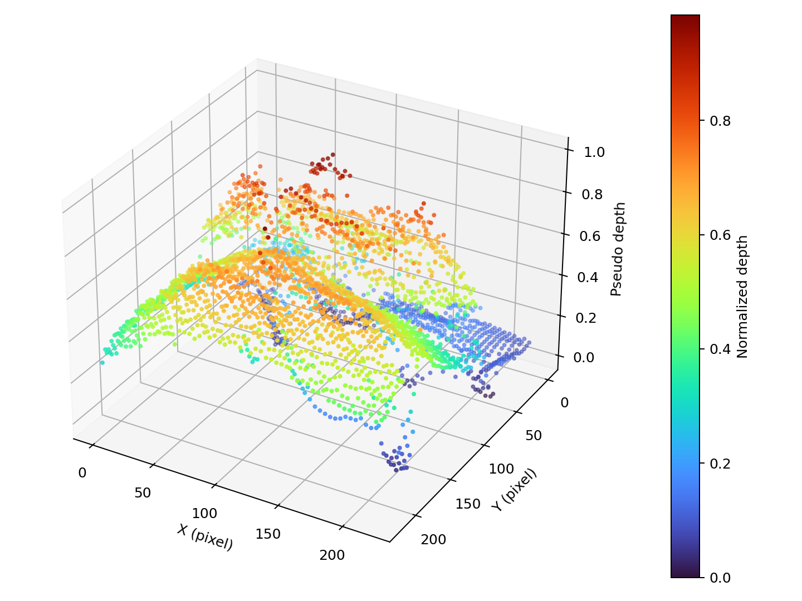

# 2주차: Unit Test 및 2D → 3D 변환

## 목표

OpenCV로 2D 이미지의 밝기를 가상 깊이값으로 변환하고, NumPy로 `(X, Y, Z)` 포인트 클라우드를 구성합니다. `pytest`로 입력 검증부터 결과 파일 생성까지 확인합니다.

## 실행 방법

```bash
pip install -r requirements.txt
python processing_3d.py
pytest -v
```

## 처리 과정

1. BGR 이미지를 Grayscale로 변환
2. Gaussian Blur로 작은 노이즈 완화
3. 밝기를 `0~255`로 정규화하여 가상 Depth Map 생성
4. 픽셀 위치를 `X, Y`, 정규화된 깊이를 `Z`로 사용하여 Point Cloud 생성
5. 원본, Depth Map, Point Cloud 데이터와 시각화 결과 저장

## 결과

| 항목 | 결과 |
| --- | --- |
| 입력 크기 | 224 × 224 |
| Depth Map | `(224, 224)`, `uint8`, 범위 0~255 |
| Point Cloud | `(224, 224, 3)`, 50,176 points |
| Unit Test | 4 passed |

### 원본 이미지


### 가상 Depth Map



### 3D Point Cloud



전체 테스트 로그는 [`results/test_results.txt`](results/test_results.txt)에서 확인할 수 있습니다.

## 분석 및 개선점

- 밝은 픽셀은 큰 Z값, 어두운 픽셀은 작은 Z값으로 표현되어 접시와 테이블의 명암 경계가 Point Cloud 높이 차이로 나타납니다.
- Gaussian Blur를 적용해 작은 밝기 노이즈가 깊이 변화로 과도하게 확대되는 현상을 줄였습니다.
- 이 결과는 실제 거리 측정값이 아니라 픽셀 밝기 기반의 **가상 깊이**입니다. 조명과 그림자에 영향을 받으므로 실제 깊이가 필요하면 MiDaS 같은 단안 깊이 추정 모델이나 Stereo Vision으로 교체해야 합니다.

## 파일 설명

- `processing_3d.py`: Depth Map, Point Cloud 생성 및 결과 저장
- `test_3d_processing.py`: 입력·출력·좌표·파일 생성 테스트
- `sample.jpg`: 1주차 전처리 결과에서 재사용한 입력 이미지
- `results/`: 변환 이미지, Point Cloud 배열, 테스트 로그
- `week2_2d_to_3d_presentation.pptx`: 4페이지 발표자료
